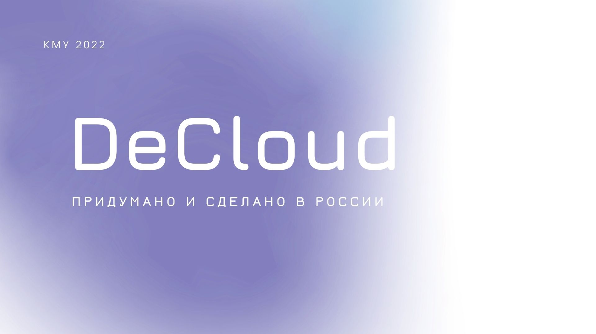
___
##### [Видео о DeCloud на YouTube][https://www.youtube.com/watch?v=fnR_V6eHojM&list=PLsdSRcrzEwaOpplGSrmqXscgpTgKfCKCN]
___

`Идеальная модель технологии хранения и распространения данных подразумевает соответствие следующим базовым критериям: соблюдение авторского права; приватность и децентрализация хранимых данных; масштабируемость; обеспечение доступа к данным в любой момент времени на любом устройстве. На нынешнем этапе развития Интернета существует множество технологий хранения информации: облако, торрент, социальные сети. Однако ни одна из них не соответствует в полной мере перечисленным критериям.`

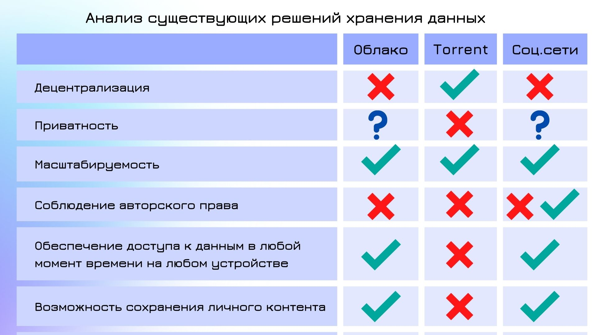

~~~~Целью моей работы является создание технологии, способной объединить все базовые критерии идеальной модели хранения и распространения данных.
Проект решает следующие задачи:
1. Децентрализация хранимых данных (создание пиринговой сети)
2. Предоставление права сохранять любые данные пользователя вне зависимости от их популярности с сети (решение – вознаграждение в виде виртуальной единице хранения)
3. Обеспечение доступа к данным в любой момент времени на любом устройстве (достигается за счет репликации фрагментов данных)
4. Приватность (два вида кошельков – публичные и приватные. Приватные шифруются)
5. Масштабируемость (за счет объединения узлов в фрейм-пулы )
6. Обеспечение  на конечных клиентских узлах совместимости с основными технологиями (например браузер)
7. Предоставление API для взаимодействия разработчиков с технологией~~~~
~~~~
В ходе работы создано туманное хранилище с открытым исходным кодом на основе блокчейн технологии (далее DeCloud). Также в процессе реализации проекта была создана пиринговая сеть, где каждый пользователь за предоставление своего дискового пространства получает возможность хранить распределенно личные данные в сети. Файлы разбиваются на части, шифруются, при необходимости фиксируется право собственности и реплицируются по сети для обеспечения отказоустойчивости.

Создано API для взаимодействия разработчиков с технологией. Для самомасштабируемости системы придуман и реализован алгоритм взаимодействия узлов сети через пулинговые ноды. Помимо хранения статических файлов реализовано потоковое сохранение информации. В клиентском хранилище возможно хранение как статических, так и динамических сайтов с NoSQL взаимодействием с файловым хранилищем, что открывает дорогу к концепции создания Web 3.0. на базе DeCloud. Web 3.0. подразумевает предоставлять информацию пользователям на основе их действий за определенную плату.  Для публичных адресов введена процедура KYC (“Знай своего клиента”) пока только на этапе верификации почтового адреса. Это необходимо для борьбы с цензурой в сети. Существует возможность двухфакторной аутентификации.

Реализация данного проекта дает неограниченные возможности для построения новой идеологии владения данными и предоставления контента по запросу конечного пользователя. Самомасштабируемость, отсутствие серверов и кибербезопасность системы отбрасывает целый стек технологий и профессий за ненадобностью. Все что необходимо пользователю - бережно хранить ключи доступа.

____________________
#### Описание составляющих

DCTP 
- (Server, Client) Для осуществления транспортировки данных по сети был создан свой протокол передачи прикладного уровня модели OSI - DCTP  (DeCloud Transfer Protocol). Реализованы клиентские приложения (desktop, android, browser) для возможности управления пользовательским файловым хранилищем.
 
Pool
- Pool является связующим звеном между всеми элементами сети. 
- Обеспечивает транспорт файлов от клиента к месту хранения и обратно. 
- Сохраняет структуру файлов в Blockchain. 
- Валидирует транзакции. 
- Запечатывает блоки.
- Участвует в конценсусе.

Fog Node
- Нода отвечает за хранение данных, размещенных в сети. 
- Доступ к данным, находящимся в ноде, имеет только пул. 
- За предоставление дискового пространства ноды вознаграждение в виде байтов получает владелец ноды
- Основываясь на ноде можно создать Pool или Client Storage

Client Storage
- Хранилище, где пользователь размещает собственные данные
- Место хранения и распространения 

ByteEx 
- В качестве единственной платежной единицы и средством хранения на базе блокчейн технологии был создан  ByteEX.
- 1 ByteEX=1 реальному байту.
- ByteEx - это криптотовар, а не криптовалюта. 
- Экономическая модель в проекте основана на владении ByteEX. 
- Эмиссия ByteEX ограничена общим объемом сети в DeCloud и распределена в интервале времени.

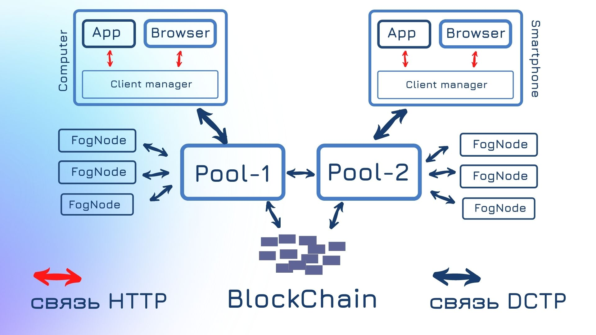

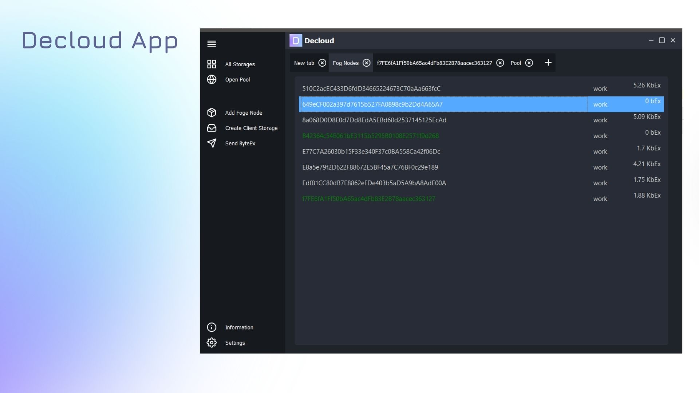

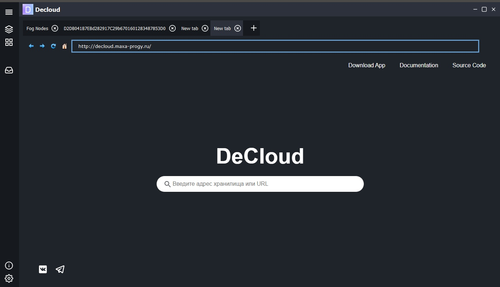
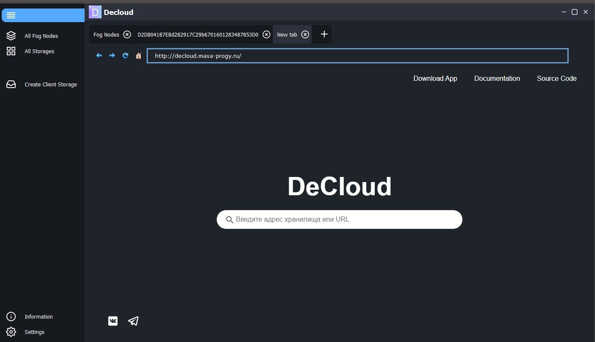
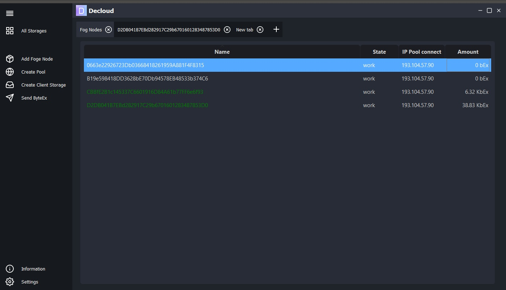

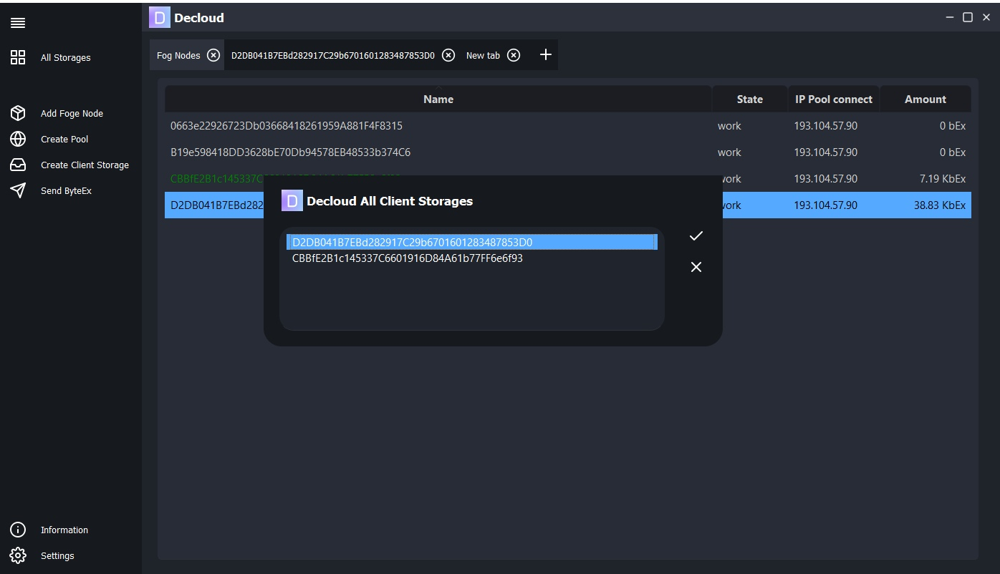
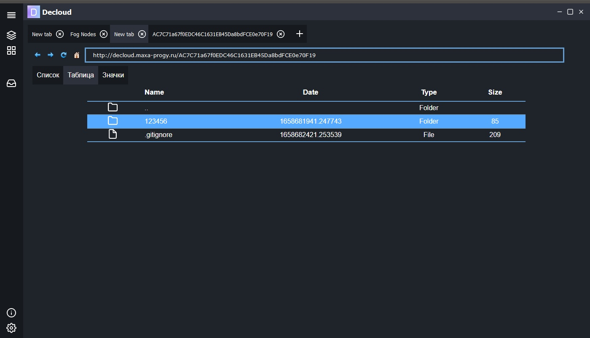
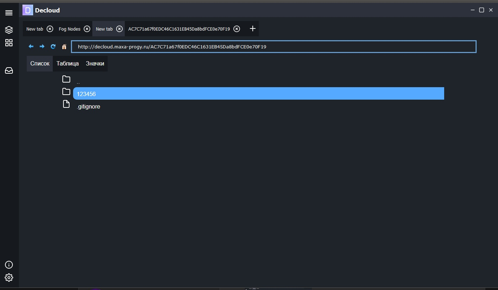
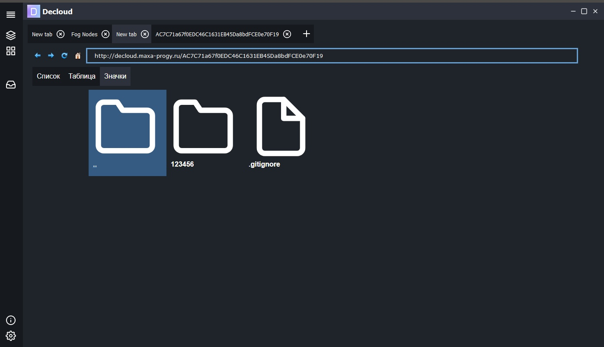

_____
[Документация и взаимодействие с проложением](static/Documentation.pdf)
_____
#### Установка и запуск Pool на Unix-подобных (Linux) системах с помощью Docker

1. `sudo apt-get update`
2. `sudo apt install git -y`
3. `sudo git clone https://github.com/MariaZyryanova72/DeCloud.git`
4. `cd DeCloud`
5. `sudo git checkout develop`
6. `source install_docker.sh`
 
#### Установка и запуск Приложения на Unix-подобных (Linux) системах с помощью Python в виртуальном окружении
 
1. `sudo apt-get update`
2. `sudo apt install git -y`
3. `sudo git clone https://github.com/MariaZyryanova72/DeCloud.git`
4. `cd DeCloud`
5. `sudo git checkout develop`
6. `source install.sh`
7. `source decloud.sh` 
 
#### Установка и запуск приложения на Windows с помощью Python в виртуальном окружении

1. Скачайте архив по ссылке и распакуйте его в нужной директории: 

`https://github.com/MariaZyryanova72/DeCloud/archive/refs/heads/develop.zip`

2. При необходимости зайти и установить python  https://www.python.org/downloads/release/python-379/

3. Откройте cmd.exe (Меню Пуск -> Служебные -> Командная строка)

4. Перейдите в ту папку, где хотите установить приложение 
   
   ` cd <путь к директории распакованного архива>`
   
5. Установка виртуального окружения
 
    `python -m venv venv`
    
6. Запуск окружения
    
    `venv\Scripts\activate.bat`

7. Устанавливаем необходимые библиотеки

    `python -m pip install -r requirements.txt`

8. Запускаем приложение

   `python decloud.py`
   
#### Установка и запуск приложения на Windows с помощью установщика

1. Скачайте по ссылке установщик и запустите его
    [Установщик тут ;)](http://decloud.maxa-progy.ru)

[https://www.youtube.com/watch?v=fnR_V6eHojM&list=PLsdSRcrzEwaOpplGSrmqXscgpTgKfCKCN]: https://www.youtube.com/watch?v=fnR_V6eHojM&list=PLsdSRcrzEwaOpplGSrmqXscgpTgKfCKCN